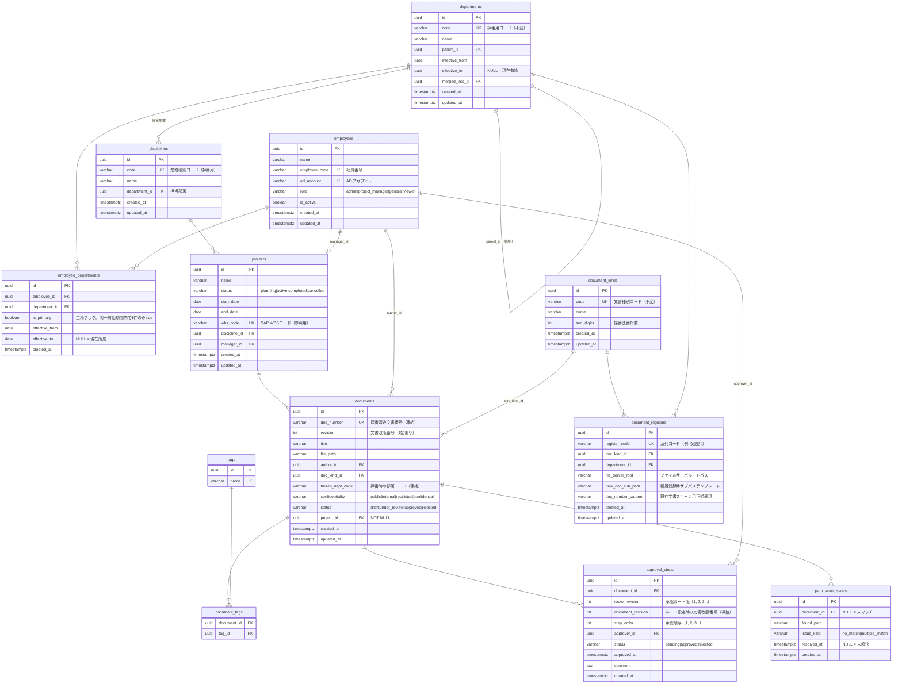

# ER 図

Mermaid による Entity-Relationship 図。実装の直接の根拠とする。

## ER 図

## 主要な設計上の判断

### 部署の有効期間モデル

`is_active` フラグではなく `effective_from / effective_to` で有効期間を管理する。
部署廃止・統合が発生しても、過去の文書番号と所属履歴をそのまま追跡できる。
`merged_into_id` で統合先へのトレーサビリティを保持する。

### 社員所属の履歴テーブル

`employees.department_id` を直接持たず、`employee_departments` で期間付き履歴を管理する。
AD 同期時に異動履歴を保持でき、過去時点の所属状況を再現できる。

兼務は同一有効期間内に複数レコードを持つことで表現する。
`is_primary` で主務を区別し、同一有効期間内で `is_primary = true` のレコードは 1 件のみ（アプリ層で制約）。

文書登録時は主務所属部署をデフォルトとして表示し、兼務部署も含めた選択が可能。
選択した部署コードが `frozen_dept_code` に凍結される。

### プロジェクトと部署の間接紐づけ

プロジェクトは `department_id` を持たず、`discipline_id` 経由で部署と紐づく。
1 プロジェクトは 1 業務種別に属し、業務種別が担当部署を持つことで暗黙的に部署が決まる。

### 文書番号の凍結

`documents.frozen_dept_code` に登録時点の部署コードをコピーして凍結する。
部署再編後も文書番号を変更する必要がなく、過去の文書番号をそのまま参照できる。
