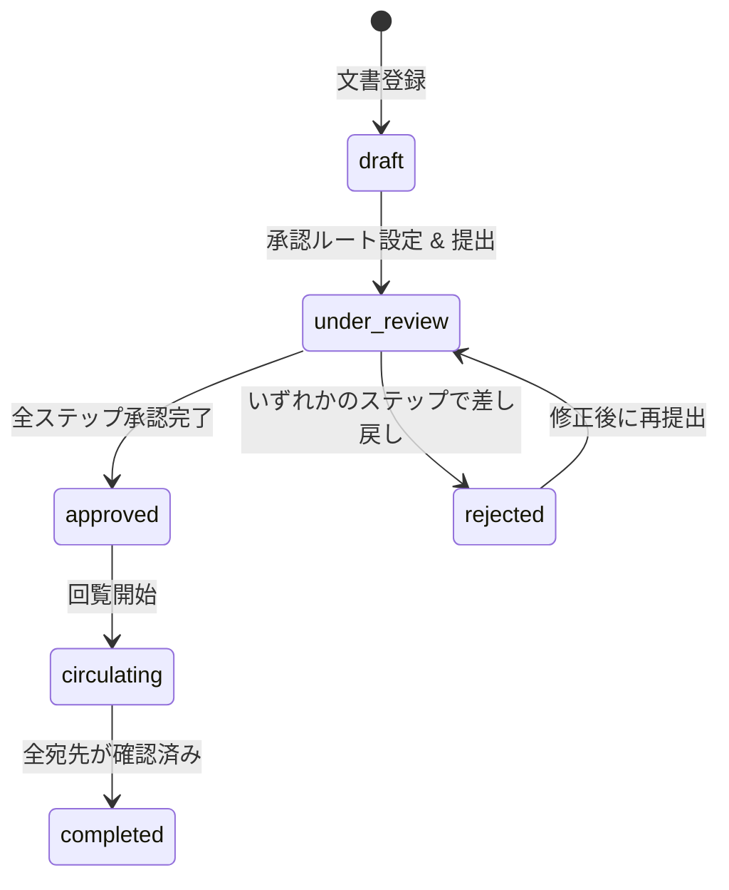
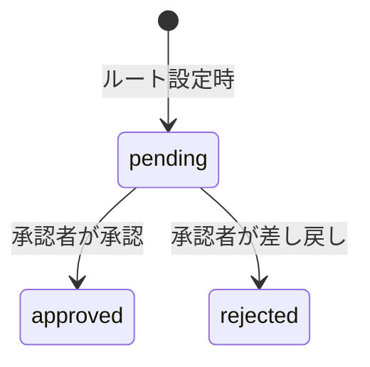

# 承認・回覧フロー仕様

## 文書ステータス遷移



| ステータス     | 説明                                       |
| -------------- | ------------------------------------------ |
| `draft`        | 作成中。承認ルート未設定または未提出       |
| `under_review` | 承認処理中。いずれかのステップが `pending` |
| `approved`     | 全承認ステップ完了                         |
| `rejected`     | いずれかのステップで差し戻し               |
| `circulating`  | 回覧中。未確認の宛先が残っている           |
| `completed`    | 全宛先が確認済み                           |

上記ステータスは `documents.status` に保存する。

---

## 段階承認

### 承認ルートの定義

`approval_steps` テーブルに承認者を `route_revision`, `step_order` 順で登録する。

```text
Step 1: 直属上長（step_order = 1）
Step 2: 部門長（step_order = 2）
Step 3: 技術担当役員（step_order = 3）
```

承認ルートの設定は文書の `draft` または `rejected` 状態中のみ可能とする。
再提出時は旧承認ルートを削除せず、新しい `route_revision` として追加する。

### アクティブステップの特定

現在処理すべきステップは以下の条件で特定する:

```sql
SELECT *
FROM approval_steps
WHERE document_id = :document_id
  AND route_revision = (
      SELECT MAX(route_revision)
      FROM approval_steps
      WHERE document_id = :document_id
  )
  AND status = 'pending'
ORDER BY step_order
LIMIT 1
```

最新 `route_revision` の中で、最小 `step_order` の `pending` ステップが現在のアクティブステップ。

### 承認処理のルール

1. アクティブステップの承認者のみが操作できる（他のステップの承認者は操作不可）
2. 承認（`approved`）: `approved_at` を現在時刻にセットし、次のステップを確認する
3. 差し戻し（`rejected`): `approved_at` を現在時刻にセットし、同一 `route_revision` の未処理 `pending` ステップを `rejected` に更新したうえで文書ステータスを `rejected` に変更する
4. 全ステップが `approved` になった場合、文書ステータスを `approved` に変更する

### ステータス遷移図（承認ステップ）



### 再提出

差し戻し（`rejected`）後に文書を修正して再提出する場合:

1. 文書作成者が文書を修正する
2. 既存 `approval_steps` は削除しない（監査履歴として保持）
3. 新しい承認ルートを `route_revision = 直近 + 1` で登録する（または同じルートを再設定する）
4. 文書ステータスを `under_review` に変更する

---

## 回覧

### 回覧の開始

文書ステータスが `approved` になった後、`circulations` テーブルに宛先を登録して回覧を開始する。
`circulating` への遷移は明示的な操作（回覧開始 API の呼び出し）によって行う。

### 既読管理

`circulations.confirmed_at` が `NULL` の場合は未確認、`NOT NULL` の場合は確認済みを示す。

未確認者の取得:

```sql
SELECT r.name
FROM circulations c
JOIN employees r ON c.recipient_id = r.id
WHERE c.document_id = :document_id
  AND c.confirmed_at IS NULL
```

### 確認操作

宛先として登録された社員が確認 API を呼び出すと、`confirmed_at` に現在時刻をセットする。
全宛先が確認済みになった場合、文書ステータスを `completed` に変更する。

### 回覧の完了条件

```sql
SELECT COUNT(*)
FROM circulations
WHERE document_id = :document_id
  AND confirmed_at IS NULL
```

上記が 0 件になった時点で `completed` に遷移する。

---

## 権限マトリクス

| 操作           | admin |      project_manager      |         general         |        viewer         |
| -------------- | :---: | :-----------------------: | :---------------------: | :-------------------: |
| 承認ルート設定 |   ○   | ○（担当プロジェクトのみ） |            -            |           -           |
| 承認・差し戻し |   ○   |  ○（自分が承認者の場合）  | ○（自分が承認者の場合） |           -           |
| 回覧宛先設定   |   ○   | ○（担当プロジェクトのみ） |            -            |           -           |
| 回覧確認       |   ○   |   ○（自分が宛先の場合）   |  ○（自分が宛先の場合）  | ○（自分が宛先の場合） |
